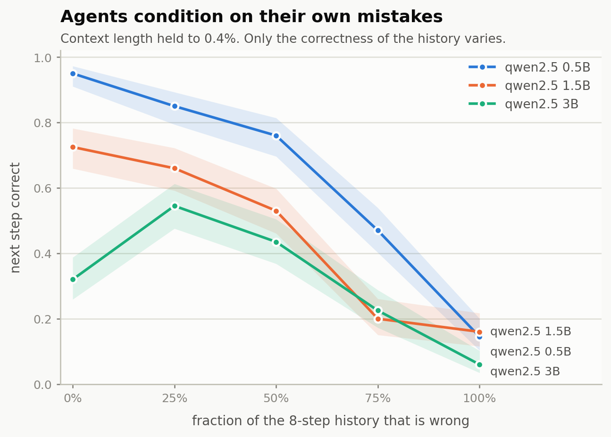
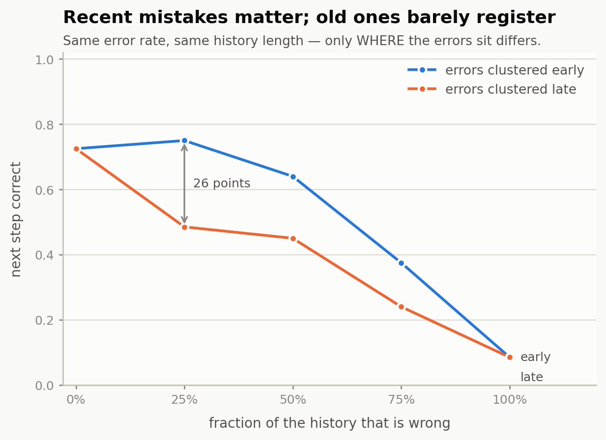
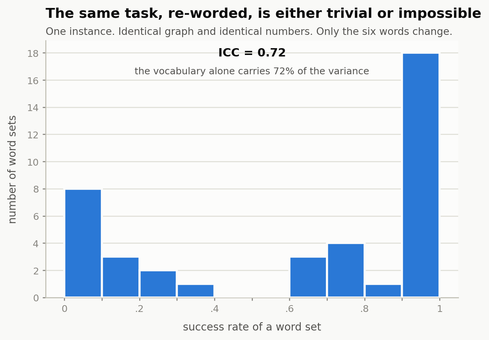

# agentfrailty

**An 8-step agent transcript. Change nothing but whether the steps were correct —
keep the length within 0.4% — and the model goes from never picking the wrong
record to picking it a quarter to a half of the time.**

And separately: **the same task, with the same graph and the same numbers, is
either trivial or impossible depending on which six English words it happens to
use.**

Measured on a base-model MacBook Air (8 GB, no fan), 7,560 episodes and probes,
three model sizes.



---

## Why this exists

Agent benchmarks report a success rate. That number turns out to hide two
different things, and this repo measures both.

**The first is that agents condition on their own errors.** This was shown by
[Sinha et al., *The Illusion of Diminishing Returns*](https://arxiv.org/abs/2509.09677)
(NeurIPS 2025) on a synthetic arithmetic task. Their Appendix I explains why they
could not do the controlled version on real agentic tasks:

> there are multiple distinct points of failure within a single trace: an error
> in the retrieval step (looking up an incorrect value) or an error in the
> composition step (an arithmetic mistake). A controlled experiment would need to
> systematically manage the type, frequency, and location of these injected
> errors, **making the setup intractable.**

In a tool environment with a ground-truth oracle at every step it is tractable.
This repo does the frequency and location axes.

**The second is that "difficulty" may not be a property of the task at all.**
[Khanal et al., *Beyond pass@1*](https://arxiv.org/abs/2603.29231) attribute
super-linear decay in agent success to within-run error correlation. But a gap
between the mean of `p` and `(mean p)^T` is also exactly what task heterogeneity
alone produces — Jensen's inequality — with zero within-run dependence. The words
*heterogeneity*, *frailty* and *random effect* do not appear in that paper. This
repo measures the heterogeneity directly, and it is enormous.

---

## Findings

### 1. Self-conditioning, on real tool calls

An 8-step history is built for the agent. A controlled fraction of those steps
are wrong turns. Context length is held to **0.4%** — 2,395 to 2,403 characters
across every arm, verified on the prompts actually sent. Then the agent takes one
more step.

Probe accuracy:

| injected error rate | qwen2.5-0.5B | qwen2.5-1.5B | qwen2.5-3B |
|---|---|---|---|
| 0% | 0.95 | 0.72 | 0.32 |
| 25% | 0.85 | 0.66 | 0.55 |
| 50% | 0.76 | 0.53 | 0.43 |
| 75% | 0.47 | 0.20 | 0.23 |
| 100% | 0.14 | 0.16 | 0.06 |

The cleaner cut is **wrong-record rate** — the agent picking a record that isn't
the one its own last observation points to:

| | 0.5B | 1.5B | 3B |
|---|---|---|---|
| healed history | **0.00** | **0.00** | **0.00** |
| fully corrupted | **0.49** (97/200) | **0.24** (49/200) | **0.54** (107/200) |

Zero in 200, on every model. Then a quarter to a half.

*The recovery hypothesis was tested and rejected.* An agent that noticed the
history had gone astray and jumped back to the canonical path would be graded
wrong by a conditional oracle. It doesn't happen: only 8–12% of wrong targets are
canonical records; 77–86% are unrelated. One probe in 200 restarted from the top.

### 2. It is a recency effect



Same error rate, same history length — only *where* the errors sit changes.

| rate | errors early | errors late |
|---|---|---|
| 0% | 0.72 | 0.72 |
| **25%** | **0.75** | **0.48** |
| 50% | 0.64 | 0.45 |
| 75% | 0.38 | 0.24 |
| 100% | 0.09 | 0.09 |

At a 25% error rate, position is worth **27 points**. Old mistakes are nearly
free — early-clustered errors leave the model slightly *above* baseline. Recent
ones are devastating. The arms converge at 0% and 100%, as they must.

### 3. Bigger models are quicker to declare victory

Share of probes that gave up and submitted **on a perfectly healed history**,
at step 8 of a 14-record chain, with nothing in the history indicating the chain
had ended:

| 0.5B | 1.5B | 3B |
|---|---|---|
| 5% | 27.5% | **68%** |

That is why the 3B's baseline reads 0.32 — not navigation failure, a stopping
prior. Three points is a trend, not a law; worth a fourth model.

### 4. Difficulty is lexical, and it is not subtle



One task instance. Identical graph, identical numbers. Only the six five-letter
words change, across 40 draws:

- success spans the **entire 0.00–1.00 range**
- the distribution is **bimodal** — 11 word sets at 0.1 or below, 18 at 0.9 or
  above, and **not one** anywhere in [0.4, 0.6)
- **ICC = 0.717 [0.564, 0.839]** — the vocabulary alone carries 72% of the
  variance

Independently, across 12 real instances at chain length 6: ICC **0.784**, with
per-instance rates of `0.00 0.07 0.07 0.60 0.93 0.93 0.93 0.93 0.93 1.00 1.00
1.00`. The pooled "70% at n=6" describes almost no actual instance.

Every failure on the impossible instances is a **premature submit**. Navigation
is never the problem; knowing the task isn't finished is.

### 5. Four mechanisms ruled out

| candidate | test | result |
|---|---|---|
| tokenization | prompt length across 40 word sets | flat at 353 tokens, r = 0.011 |
| the numbers | revalue, hold words and graph fixed | easy instances stay at 0.90–0.98 |
| graph structure | same words and numbers, 3 different topologies | identical, 0.66 on all |
| abstractness | curated abstract vs concrete pools | inconclusive — see below |

Also tested and null: letter overlap (r=0.06), shared initials (r=0.32, dead
after multiple comparisons), repeated letters (r=−0.12), distinct letters (0.04).

**What makes a word set hard is open.** That is the honest state of it.

---

## The environment

A pointer-chase ledger. Each record holds a value and the id of the next record.
The agent starts at a known record, follows the chain, and submits the total.

Four properties, each enforced by test:

- **N is required, not observed.** The id of position *i+1* is learnable only by
  reading position *i*, so a chain of N records cannot be solved in fewer than N
  calls. τ²-bench and TRAJECT-Bench plot success against the number of calls an
  agent *happened* to make, which confounds task difficulty with chain length.
- **Inherently sequential.** 2509.09677 concedes its running-sum task is
  associative and therefore parallelizable in principle. A pointer chase is not.
- **An objective oracle at every step.** Exactly one call is correct at each
  position, which is what 2509.09677's Appendix A lacked when it looked for
  self-conditioning in GAIA/ALFWorld/WebShop (*"correctness of steps is
  subjective to determine on these tasks"*).
- **The environment never fails.** Unknown ids and malformed arguments are *agent*
  errors returned as ordinary tool results. `env_error` is reserved for bugs in
  the environment and has stayed empty across all 7,560 episodes.

Every step is graded twice. `on_canonical` is absorbing — one wrong turn and
everything after is off. `locally_correct` is conditional: given where the agent
*actually* is, was this the right move? An agent that misreads one pointer and
then follows the wrong chain flawlessly is locally correct throughout. Without
that second view the two hypotheses are indistinguishable, because the absorbing
view is zero after the first error by construction.

---

## Three bugs worth reporting

**A scoring bug manufactured the effect it appeared to measure.** The parser
rejected `{"total": 67 - 2 - 46}` — which is 19, the correct answer. That parse
failure then sent the model into a six-step prose spiral, degrading from the
right expression to a wrong number: a textbook self-conditioning cascade,
produced entirely by our own scorer poisoning the context. Had it reached the
full run it would have yielded a complete, plausible dataset supporting the
thesis, undetectable from outside.

(2509.09677's Appendix H hit the same behaviour in Qwen3-8B — *"the model trying
to cheat, and do the entire summation inside the `<answer>` tags"* — and counts
it as an error. Here it is repaired and the repair is recorded, so strict and
lenient numbers stay separable.)

**The control reintroduced the confound it existed to remove.** The first
injection implementation let wrong turns land on dead-end records, so high-error
histories ran 49% *shorter* than healed ones — which would have made long-context
degradation look exactly like self-conditioning. Caught by the test written for
that property.

**An experiment was irreproducible for two weeks without anyone noticing.**
`vocab.py` seeded its word draws with `hash(arm)`, which Python randomises per
process. Two runs of the identical command produced opposite readings. Found by
re-running everything from a clean tree; the experiment is excluded from the
findings above and marked inconclusive in the source.

An earlier interpretation was also overturned by its own control: calibration
suggested the 0.5B "cannot follow a pointer." On a healed history it scores 0.95,
better than the 1.5B, and collapses hardest under injection. Calibration had been
observing it inside its own already-derailed trajectories.

---

## Reproducing

```bash
pip install -e ".[analysis]"
ollama serve
ollama pull qwen2.5:0.5b-instruct qwen2.5:1.5b-instruct qwen2.5:3b-instruct

python3 scripts/killtest.py --models qwen2.5:1.5b-instruct   # the viability gate
python3 scripts/run.py --config configs/calibrate.yaml
python3 scripts/run.py --config configs/pilot.yaml
python3 scripts/inject.py --model qwen2.5:1.5b-instruct --repeats 40
python3 scripts/ablate.py
python3 scripts/wordsweep.py --base-seed 11 --word-sets 40 --repeats 10

python3 scripts/analyze.py --in results/pilot.jsonl
python3 scripts/power.py   --in results/pilot.jsonl
python3 scripts/plot.py
```

Seeds are pinned and Ollama honours them, so runs are deterministic: every table
above reproduced to the digit on an independent clean-tree run. Every row carries
its git commit and a dirty-tree flag; `analyze.py` refuses to average silently
across code versions.

Nothing derived is stored. Success is computed from `final_state` vs `goal_state`
at analysis time, so the scorer can change without re-running inference — which
it did, twice.

## Layout

```
agentfrailty/
  envs/ledger.py       the environment; make_task, remix_task, relabel_task
  scorers/trajectory.py  dual grading, error taxonomy, step-accuracy curves
  agent.py             ReAct loop, per-step logging, transcript rendering
  injection.py         healed-history construction
  parsing.py           tool-call extraction + arithmetic repair
  schema.py            episode rows, append-only JSONL, provenance
  stats.py             Wilson, dispersion/ICC, bootstrap, permutation test
  runtimes/            ollama / llama.cpp / mlx adapters (from quantcost)
scripts/               killtest, run, inject, ablate, wordsweep, vocab,
                       analyze, power, plot, smoke
tests/                 7 files, ~200 checks
```

## Limitations

- One model family (Qwen2.5), three sizes, one machine.
- One task family. The lexical result is measured on five-letter English words
  in a pointer chase; whether it generalises is untested.
- Findings 1–3 are measured at a **single probe step**. Whether the effect
  compounds across a full episode is a separate question.
- The pilot uses 12 instances × 15 repeats. Adequate to establish that
  heterogeneity is large; not enough to model it.
- The wrong records chosen during injection are themselves a variance component
  — two runs at the same error rate with different targets differed by 7 points.
- `results/` is the raw record. It is committed uncompressed for now.

## Next

- What property of a word set makes it hard. The open question.
- The **type** axis of Appendix I — navigation vs arithmetic error injection —
  which needs a task variant where the agent states its running total each step.
- A fourth model, for the premature-submit trend.
- Scaling the pilot: 40 instances × 25 repeats × 7 chain lengths.

## Prior work by the same author

[quantcost](https://github.com/Ani-2003-HD/quantcost) — what quantization
actually costs in quality, measured on the same machine. The runtime adapters and
system monitors here are reused from it.

## License

MIT — see [LICENSE](LICENSE).
